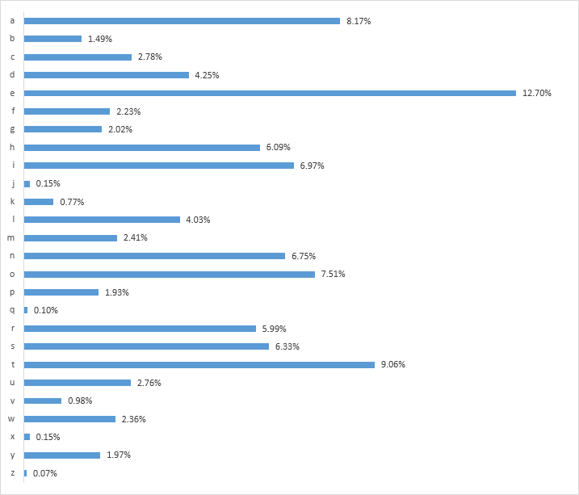

# 古典密码
## 最原始的古典密码--凯撒密码
首先介绍的是凯撒密码 原理如下
```c
unsigned char message[];
cipher[i]=(message[i]+key-'A'('a'))%26+'A'('a');
```
就是个简单的移位密码，问题是密钥太短，可以进行爆破，具体例题详见附件task1。
解题思路，爆破key即可。

## OTP
一次一密。原理已在密码学简介中提到，在ctf题目中，例题详见附件task2。
加密原理代码如下
```c
#include<stdlib.h>
#include<string.h>
#define MAX 10
const char Sbox[]={1,2,3,4};
const char text[]={0x32,0x34,0x37,0x48,0x59};
char cipher[MAX];
int main(){
    for(int i=0;i<strlen(text);i++){
        cipher[i]=text[i]^Sbox[i%strlen(Sbox)];
    }
}
```

## 单表替换密码
### 加密原理
将每一个字母替换成另一个字母，具体替换规则需要一个密码本
### 攻击原理
根据语言学统计，英文文本的字母e含量最高，t、a这些也是含量很高的字母，如果密文文本足够大，就可以用这个方式来破解。下图是统计意义下各个字母出现的频率。


例题详见task3。

## 实战挑战（bonus）
### 背景
本题来自2024年浙江省大学生网络与信息安全竞赛。本题是misc方向签到题，原题是隐写了某个hint，然后根据hint去解题。但是和本人一队的cyrus28214老师想出了一个非预期。成功做出了这道题，于是我将该题的hint去掉，出了这道题，本题的解法就是那道题的非预期解。
详见NoHintForYou~。